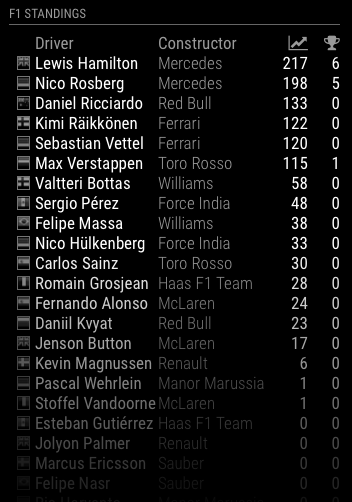

# MagicMirror Module: MMM-Formula1

A MagicMirror Module for displaying Formula 1 standings and race schedule.

[](https://MagicMirror.builders)
[](https://raw.githubusercontent.com/ianperrin/MMM-Formula1/master/LICENSE)
[](https://travis-ci.org/ianperrin/MMM-Formula1)
[](https://codeclimate.com/github/ianperrin/MMM-Formula1)
[](https://snyk.io/test/github/ianperrin/MMM-Formula1)

## Example



### The module displays the current Formula 1 standings table from the selected season with the following information

* The flag for the driver or constructor.
* The drivers name (when the drivers standings are displayed).
* The constructor name.
* The current points total.
* The current number of wins.

### In addition you can configure the following options

* Which season to display the standings for `season`
* Whether to show the drivers or constructors standings `type`
* How many drivers/constructors to display in the standings table `maxRows`
* Display the upcoming race schedule using the standard [calendar](https://github.com/MichMich/MagicMirror/tree/develop/modules/default/calendar) module

## Installation

In your terminal, go to your MagicMirror's Module folder:

````bash
cd ~/MagicMirror/modules
````

Clone this repository:

````bash
git clone https://github.com/ianperrin/MMM-Formula1.git
````

Configure the module in your `config/config.js` file.

## Updating

If you want to update your MMM-Formula1 module to the latest version, use your terminal to go to your MMM-Formula1 module folder and type the following command:

````bash
git pull
````

If using the Race Schedule, (re)install `ical-generator`.

````bash
npm install ical-generator
````

If you haven't changed the modules, this should work without any problems.
Type `git status` to see your changes, if there are any, you can reset them with `git reset --hard`. After that, git pull should be possible.

## Using the module

To use this module, add it to the modules array in the `config/config.js` file:

````javascript
modules: [
    {
        module: 'MMM-Formula1',
        position: 'top_right',
        header: 'F1 Standings',
        config: {
            // Optional configuration options - see https://github.com/ianperrin/MMM-Formula1#configuration-options
        }
    },
]
````

## Configuration options

The following properties can be configured:

| **Option** | **Default** | **Description** | **Possible Values** |
| --- | --- | --- | --- |
| `season` | `current` | *Optional* - The season to display. | `current` = Standings for the current season, or a year (greater than or equal to `1950`) = Standings for a specific season. |
| `type` | `DRIVER` | *Optional* - The type of standings to display. | `DRIVER` or `CONSTRUCTOR` |
| `maxRows` | `false` | *Optional* - The maximum number of drivers/constructors to show in the standings table. |  `false` or a `number`. |
| `calendar` | `false` | *Optional* - Whether the module should publish the upcoming Race Schedule as an ical. | `true` or `false`. |
| `fade` | `true` | *Optional* - Whether to fade the activities to black (Gradient). | `true` or `false` |
| `fadePoint` | `0.4` | *Optional* - Where to start fade? |  `0` (top of the list) - `1` (bottom of list) |
| `reloadInterval` | `1800000` (30 minutes) | *Optional* - How often does the data needs to be reloaded from the API? (Milliseconds). See the [Terms & Conditions](http://ergast.com/mrd/terms/) for responsible use of the API. |  `7500` - `86400000` |
| `animationSpeed` | `2500` (2.5 seconds) | *Optional* - The speed of the update animation. (Milliseconds). | `0` - `5000` |
| `grayscale` | `true` | *Optional* - Whether to show the flags in grayscale (`true`) or colour (`false`). |  `true` or `false` |
| `showFooter` | `true` | *Optional* - Whether to show the footer below the table with information about the season and round. |  `true` or `false` |

### Displaying the Race Schedule

Stop your Magic Mirror (your exact method may vary)

````bash
pm2 stop mm
````

Install `ical-generator` in your MMM-Formula1 module directory.

````bash
cd ~/MagicMirror/modules/MMM-Formula1
npm install ical-generator
````

Set the `calendar` option for your MMM-Formula1 module to true.

````javascript
config: {
    // Optional configuration options - see https://github.com/ianperrin/MMM-Formula1#configuration-options
    calendar: true,
}
````

Add the Formula 1 Race Schedule calendar to the `calendar` module to your configuration (`config/config.js`).

````javascript
{
    symbol: 'flag-checkered',
    url: 'http://localhost:8080/MMM-Formula1/schedule.ics',
}
````

Restart your Magic Mirror (your exact method may vary)

````bash
pm2 start mm
````
